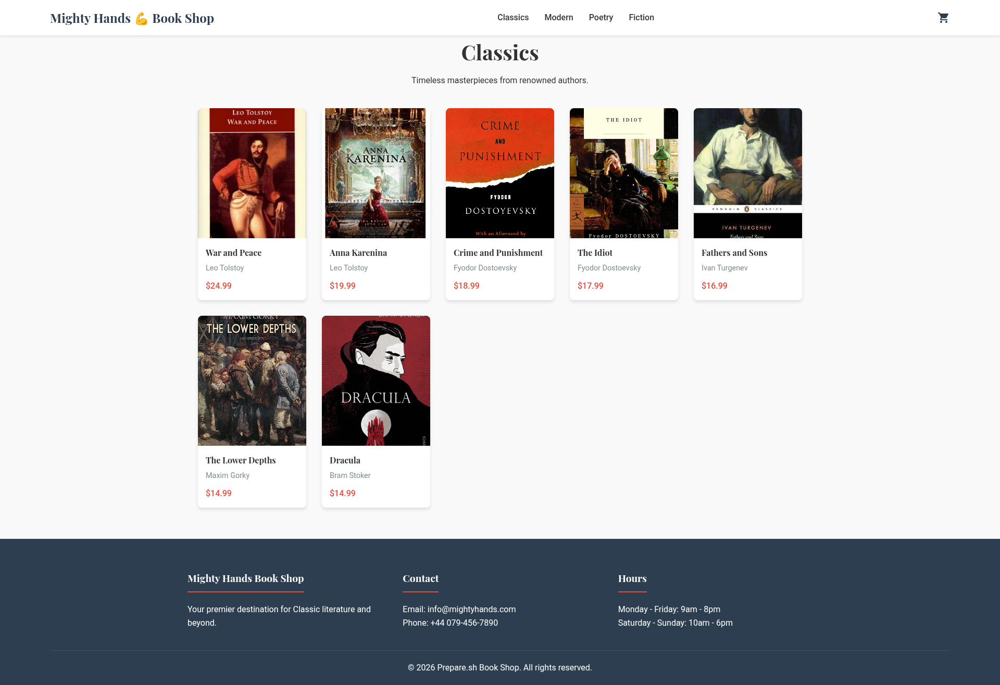
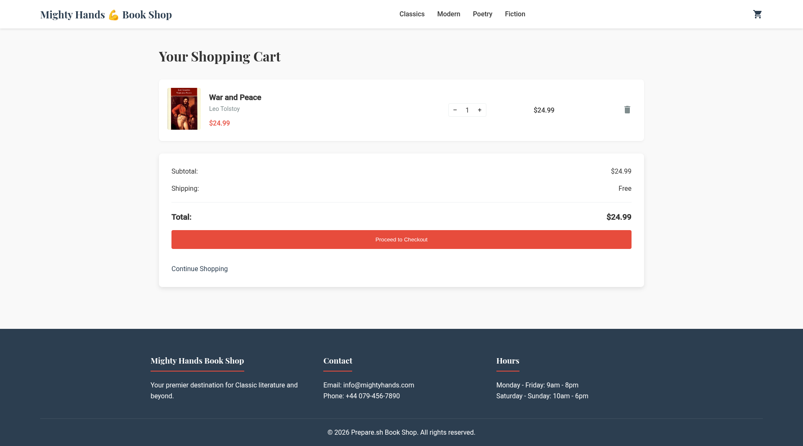
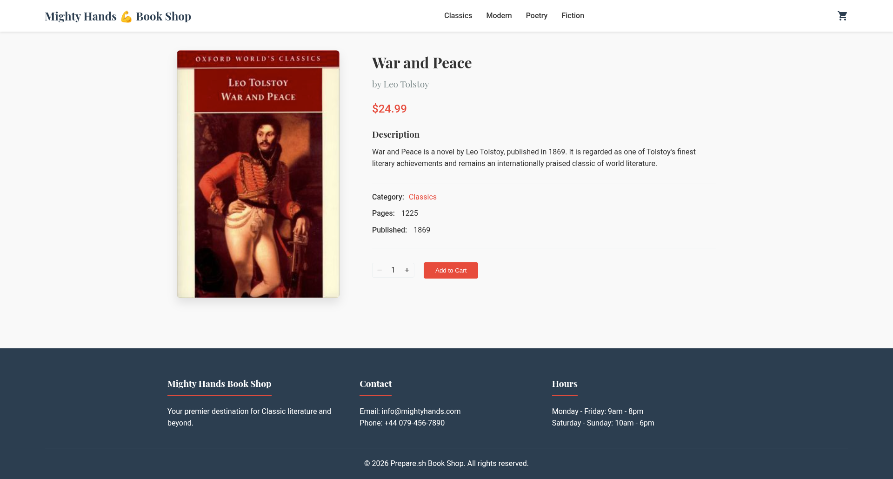
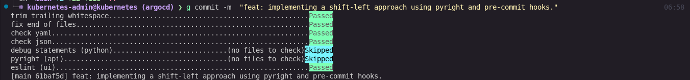
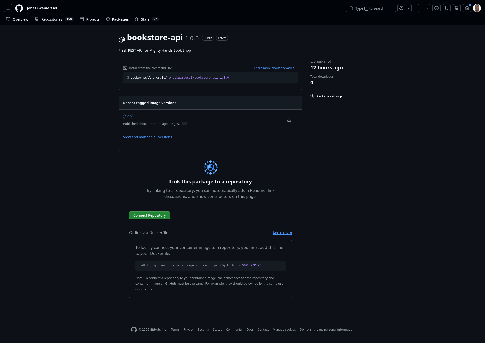
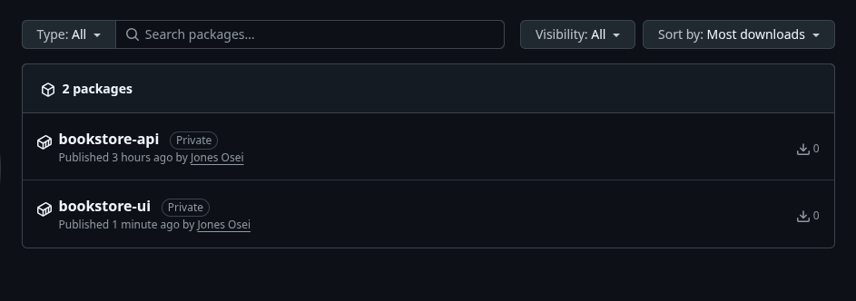
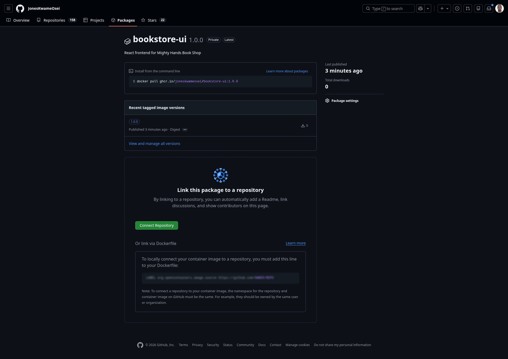

# Mighty Hands 💪 Book Shop

A full-stack bookstore web application built as a DevOps project. The project follows a shift-left approach, embedding quality gates from the very first commit and progressing through containerisation and beyond.


---

## Table of Contents

- [Project Overview](#project-overview)
- [Tech Stack](#tech-stack)
- [Project Structure](#project-structure)
- [Application Development Locally](#application-development-locally)
  - [Prerequisites](#prerequisites)
  - [Running the API](#running-the-api)
  - [Running the Frontend](#running-the-frontend)
  - [Application in Action](#application-in-action)
- [Shift-Left Quality Approach](#shift-left-quality-approach)
  - [Pre-commit Hooks](#pre-commit-hooks)
  - [Hook Setup](#hook-setup)
  - [Bugs Caught Before Commit](#bugs-caught-before-commit)
- [Containerisation](#containerisation)
  - [Dockerfile Best Practices Applied](#dockerfile-best-practices-applied)
  - [Authenticate with GitHub Container Registry](#authenticate-with-github-container-registry)
  - [Build the API Image](#build-the-api-image)
  - [Run the Container Locally](#run-the-container-locally)
  - [Tag and Push to GHCR](#tag-and-push-to-ghcr)
  - [Pull and Run Image from GHCR](#pull-and-run-image-from-ghcr)
- [Containerise Frontend UI](#containerise-frontend-ui)
  - [Dockerfile Best Practices Applied](#dockerfile-best-practices-applied-1)
  - [Build the UI Image](#build-the-ui-image)
  - [Run the Container Locally](#run-the-container-locally-1)
  - [Tag and Push to GHCR](#tag-and-push-to-ghcr-1)
  - [Pull and Run Image from GHCR](#pull-and-run-image-from-ghcr-1)
- [Deploy Frontend UI and Backend API in Kubernetes](#deploy-frontend-ui-and-backend-api-in-kubernetes)
  - [Kubernetes Security and Hardening](#kubernetes-security-and-hardening)
  - [Manifest Structure](#manifest-structure)
  - [Deploy Application Backend API](#deploy-application-backend-api)
  - [Deploy Application Frontend UI](#deploy-application-frontend-ui)
  - [Real-World Operations](#real-world-operations)

---

## Project Overview

Mighty Hands Book Shop is a browsable online bookstore serving a curated catalogue of classic and modern literature. Users can browse books by category, view product details, add items to a shopping cart, and proceed to checkout.

The application is composed of two services that run alongside each other:

| Service | Technology | Port |
|---------|------------|------|
| Frontend | React 19 | 3000 |
| API | Python Flask | 5000 |

---

## Tech Stack

**Frontend**
- React 19, React Router v7
- CSS (custom, no UI framework)
- ESLint (react-app ruleset)

**Backend**
- Python 3.13, Flask 2.2, Flask-CORS
- psycopg — PostgreSQL driver (wired for database integration)

**Quality & DevOps**
- `pyright` — static type checking for Python
- `eslint` — static analysis for JavaScript / JSX
- `pre-commit` — enforces quality gates on every commit

---

## Project Structure

```
devops-project-bookstore/
├── api/                     # Flask REST API
│   ├── main.py
│   ├── requirements.txt     # includes pyright and pre-commit
│   └── pyrightconfig.json
├── ui/                      # React frontend
│   ├── src/
│   │   ├── components/
│   │   ├── pages/
│   │   └── App.js
│   └── package.json
├── images/
├── .pre-commit-config.yaml  # shared shift-left hook config
└── README.md
```

---

## Application Development Locally

### Prerequisites

| Tool | Minimum version |
|------|----------------|
| Python | 3.10 |
| Node.js | 18  |
| pipx | any |

Both services must run at the same time. The React dev server proxies all `/api` requests to `http://127.0.0.1:5000`.

---

### Running the API

> Full instructions: [api/README.md](api/README.md)

```bash
cd api
python3 -m venv venv
source venv/bin/activate
pip install -r requirements.txt
python main.py
```

API available at `http://127.0.0.1:5000`

---

### Running the Frontend

> Full instructions: [ui/README.md](ui/README.md)

```bash
cd ui
npm install
npm start
```

App available at `http://localhost:3000`

---

### Application in Action


**Browsing the catalogue**



**Shopping cart**



**Adding to cart**



---

## Shift-Left Quality Approach

Quality is enforced at the earliest stage of the development cycle — before code is committed. Both services are covered by pre-commit hooks that block a commit if type errors or lint violations are present, meaning bugs are caught locally rather than in CI or code review.

### Pre-commit Hooks

| Hook | Scope | Tool | What it catches |
|------|-------|------|-----------------|
| `pyright` | `api/` | pyright | Python type errors, `None`-safety violations |
| `eslint` | `ui/src/` | ESLint | React rule violations, undefined variables, hooks misuse |
| `trailing-whitespace` | all files | pre-commit-hooks | Trailing spaces |
| `end-of-file-fixer` | all files | pre-commit-hooks | Missing newline at end of file |
| `check-yaml` / `check-json` | all files | pre-commit-hooks | Config syntax errors |
| `debug-statements` | Python files | pre-commit-hooks | Accidental `pdb` / `breakpoint()` left in code |

Hook configuration: [.pre-commit-config.yaml](.pre-commit-config.yaml)

---

### Hook Setup

Install `pre-commit` and `pyright` globally via pipx (one-time per machine):

```bash
pipx install pre-commit
pipx install pyright
```

Install all dependencies, then wire up the git hook from the repo root:

```bash
pip install -r api/requirements.txt
cd ui && npm install && cd ..
pre-commit install
```

Output:

```
pre-commit installed at .git/hooks/pre-commit
```

---

### Bugs Caught Before Commit

On the first run, pyright surfaced a `None`-safety violation in the Flask API — `request.json` is typed as `Any | None` and calling `.get()` on it without a null check would crash at runtime on any malformed request:


After fixing both affected route handlers (`add_to_cart`, `update_cart`) to use `request.get_json(silent=True) or {}`, all hooks pass:


ESLint also runs on every commit against the React source, blocking any lint violation before it reaches the codebase:



For the full root-cause analysis see [api/README.md → Bugs caught on first run](api/README.md#bugs-caught-on-first-run).

---

## Containerisation

Both services are containerised using hardened, production-ready Docker images and published to the GitHub Container Registry (GHCR). All Dockerfiles follow Docker and Sysdig best practices throughout.

### Dockerfile Best Practices Applied

| Practice | Implementation |
|----------|---------------|
| Multi-stage build | `builder` stage compiles deps; `runtime` stage carries only the app and venv |
| Non-root user | `appuser` system account with no login shell — process never runs as root |
| Trusted, pinned base image | `python:3.13-slim` — official image, specific version tag |
| Minimal attack surface | Build tools (`gcc`, `libpq-dev`) stay in the builder stage only |
| No dev dependencies | `pre-commit` and `pyright` live in `requirements-dev.txt` and are excluded from the image |
| COPY over ADD | No `ADD` instruction used |
| `.dockerignore` | Excludes `venv/`, `__pycache__/`, dev config files from the build context |
| Pinned apt versions | All `apt-get install` packages pinned by version |
| OCI metadata labels | Full label block: title, description, version, author, source, licence |
| HEALTHCHECK | Polls `/api/categories` every 30 s; container reports `healthy`/`unhealthy` |
| Production server | `gunicorn` replaces Flask's built-in dev server |
| Hadolint | Linted to zero warnings before pushing |

Dockerfile: [api/Dockerfile](api/Dockerfile) — `.dockerignore`: [api/.dockerignore](api/.dockerignore)

---

### Authenticate with GitHub Container Registry

Access to GHCR requires a Personal Access Token (PAT). Generate one at:

**GitHub → Settings → Developer settings → Personal access tokens → Generate new token (classic)**

Assign the following scopes:
- `write:packages` — push images
- `read:packages` — pull images
- `repo` — required for private repositories

Login with the token:

```bash
echo <YOUR_PAT> | docker login ghcr.io -u <YOUR_GITHUB_USERNAME> --password-stdin
```

> In GitHub Actions workflows, use the automatic `secrets.GITHUB_TOKEN` — no PAT management needed. See the CI/CD section for the signing workflow.

---

### Build the API Image

> This project runs `nerdctl + buildkit` on a homelab node, aliased as `docker=sudo nerdctl`.

```bash
docker build -t bookstore-api:1.0.0 ./api
```

Confirm the image:

```bash
docker image ls
```

```
REPOSITORY       TAG      IMAGE ID        CREATED           PLATFORM       SIZE       BLOB SIZE
bookstore-api    1.0.0    <image-id>      2 minutes ago     linux/amd64    171.1MB    55.07MB
```

---

### Run the Container Locally

```bash
docker run -d --network host --name bookstore-api bookstore-api:1.0.0
```

Test it:

```bash
curl http://127.0.0.1:5000/api/products/1
```

```json
{"author":"Leo Tolstoy","category":"Classics","id":"1","name":"War and Peace","price":24.99,...}
```

> **Note on networking:** This node uses Cilium CNI for Kubernetes. nerdctl port mapping (`-p`) does not work with Cilium — use `--network host` for local testing, or curl the container IP directly (`docker inspect <id>` to find it).

Check health status:

```bash
docker ps
# STATUS: Up X minutes (healthy)
```

---

### Tag and Push to GHCR

Tag the local image with the full registry path:

```bash
docker tag bookstore-api:1.0.0 ghcr.io/joneskwameosei/bookstore-api:1.0.0
```

Confirm tag image:

```bash
docker image ls
```

**Outout**:

```bash
REPOSITORY                              TAG      IMAGE ID        CREATED           PLATFORM       SIZE       BLOB SIZE
ghcr.io/joneskwameosei/bookstore-api    1.0.0    <image-id>      41 minutes ago    linux/amd64    171.1MB    55.07MB
bookstore-api                           1.0.0    <image-id>      2 hours ago       linux/amd64    171.1MB    55.07MB
```

Push to GHCR:

```bash
docker push ghcr.io/joneskwameosei/bookstore-api:1.0.0
```

The image is published at: `ghcr.io/joneskwameosei/bookstore-api:1.0.0`



### Pull and Run Image from GitHub Registry

Now remove local images, pull and run image from the registry:

Remove local images

```bash
docker image rm bookstore-api:1.0.0
docker image rm ghcr.io/joneskwameosei/bookstore-api:1.0.0
```

Confirm images are removed

```bash
docker image ls -q | wc -l
```

**Output**:

```bash
0
```

Pull image:

```bash
docker image pull ghcr.io/joneskwameosei/bookstore-api:1.0.0
```

Confirm image is pulled successfully:

```bash
docker image ls -q | wc -l
docker image ls
```

**Output**:

```bash
1

REPOSITORY                              TAG      IMAGE ID        CREATED          PLATFORM       SIZE       BLOB SIZE
ghcr.io/joneskwameosei/bookstore-api    1.0.0    <image-id>      4 minutes ago    linux/amd64    171.1MB    55.07MB
```

Run pulled image:

```bash
docker container run -d --network=host --name bookstore-api ghcr.io/joneskwameosei/bookstore-api:1.0.0
```

confirm container is running:

```bash
curl http://127.0.0.1:5000/api/products/1
```

**Output**:

```bash
{"author":"Leo Tolstoy","category":"Classics","categoryId":"classics","description":"War and Peace is a novel by Leo Tolstoy, published in 1869. It is regarded as one of Tolstoy's finest literary achievements and remains an internationally praised classic of world literature.","id":"1","imageUrl":"/images/books/war-and-peace-leo-tolstoy.jpg","name":"War and Peace","pages":1225,"price":24.99,"published":1869}
```

```bash
docker container ls
```

**Output**:

```bash

CONTAINER ID      IMAGE                                         COMMAND                   CREATED          STATUS    PORTS    NAMES
<container-id>    ghcr.io/joneskwameosei/bookstore-api:1.0.0    "gunicorn --bind 0.0…"    2 minutes ago    Up                 bookstore-api
```

## Containerise Frontend UI

The React UI is served in production by **nginx** inside a multi-stage Docker image. The builder stage produces the optimised static bundle; the runtime stage is a minimal nginx image with no Node.js or build tooling.

### Dockerfile Best Practices Applied

| Practice | Implementation |
|----------|---------------|
| Multi-stage build | `node:22-alpine` builder → `nginx:1.27-alpine` runtime |
| Non-root user | `nginx` user (uid 101, pre-created in the image) — port 8080 requires no root |
| Trusted, pinned base image | `node:22-alpine` and `nginx:1.27-alpine` — no `latest` tag |
| Reproducible install | `npm ci` reads `package-lock.json` — all versions exactly pinned |
| Layer caching | `package.json` / `package-lock.json` copied before source — deps layer survives code-only changes |
| Minimal runtime image | Final image contains only nginx and the static build — no Node.js |
| COPY over ADD | No `ADD` instruction used |
| `.dockerignore` | Excludes `node_modules/`, `build/`, env files from the build context |
| OCI metadata labels | Full label block: title, description, version, author, source, licence |
| HEALTHCHECK | `wget` polls `localhost:8080` every 30 s |
| Custom nginx config | SPA routing (`try_files`), long-lived cache headers, gzip, non-root temp paths |
| Hadolint | Linted to zero warnings before pushing |

Dockerfile: [ui/Dockerfile](ui/Dockerfile) — nginx config: [ui/nginx.conf](ui/nginx.conf) — `.dockerignore`: [ui/.dockerignore](ui/.dockerignore)

---

### Build the UI Image

```bash
docker image build -t bookstore-ui:1.0.0 .
```

Image built successfully:

```bash
[+] Building 38.8s (15/15)
[+] Building 38.9s (15/15) FINISHED
Loaded image: docker.io/library/bookstore-ui:1.0.0
```

Confirm the image:

```bash
docker image ls
```

```bash
REPOSITORY       TAG      IMAGE ID        CREATED           PLATFORM       SIZE       BLOB SIZE
bookstore-ui     1.0.0    <image-id>      2 minutes ago     linux/amd64    <size>     <blob-size>
bookstore-api    1.0.0    <image-id>    X hours ago       linux/amd64    171.1MB    55.07MB
```

---

### Run the Container Locally

```bash
docker container run -d --network host --name bookstore-ui bookstore-ui:1.0.0
```

Test it:

```bash
curl -I http://127.0.0.1:8080
```

Api responded with the code: 200 OK

```bash
HTTP/1.1 200 OK
Server: nginx/1.2x.x
Date: Sat, 06 Jun 2026 19:33:27 GMT
Content-Type: text/html
```

Check health status:

```bash
docker container ls
# STATUS: Up X minutes (healthy)
```

App is healthy:

```bash
CONTAINER ID      IMAGE                                          COMMAND                   CREATED          STATUS    PORTS    NAMES
<container-id>    docker.io/library/bookstore-ui:1.0.0           "/docker-entrypoint.…"    5 minutes ago    Up                 bookstore-ui
```

> **Note on networking:** As with the API, we will utilise `--network host` on this Cilium node. The UI runs on port **8080** (nginx configured as non-root — port 80 requires root).
---

### Tag and Push to GHCR

Tag with the full registry path:

```bash
docker image tag bookstore-ui:1.0.0 ghcr.io/joneskwameosei/bookstore-ui:1.0.0
```

Confirm both tags:

```bash
docker image ls
```

```
REPOSITORY                             TAG      IMAGE ID     CREATED          PLATFORM       SIZE
ghcr.io/joneskwameosei/bookstore-ui    1.0.0    <image-id>   X minutes ago    linux/amd64    <size>
bookstore-ui                           1.0.0    <image-id>   X minutes ago    linux/amd64    <size>
```

Push to GHCR:

```bash
docker push ghcr.io/joneskwameosei/bookstore-ui:1.0.0
```

The image is published at: `ghcr.io/joneskwameosei/bookstore-ui:1.0.0`




---

### Pull and Run Image from GHCR

Remove local images:

```bash
docker image rm bookstore-ui:1.0.0
docker image rm ghcr.io/joneskwameosei/bookstore-ui:1.0.0
```

Confirm removed:

```bash
docker image ls -q | wc -l
```

**Output**:

```bash
0
```

Pull from registry:

```bash
docker image pull ghcr.io/joneskwameosei/bookstore-ui:1.0.0
```

**Output**:

```bash
Completed pull from OCI Registry (ghcr.io/joneskwameosei/bookstore-ui:1.0.0)    elapsed: 1.5 s  total:  22.9 M  (15.4 MiB/s)
```

Run the pulled image:

```bash
docker container run -d --network host --name bookstore-ui ghcr.io/joneskwameosei/bookstore-ui:1.0.0
```

Confirm it is serving:

```bash
curl -I http://127.0.0.1:8080
```

```bash
HTTP/1.1 200 OK
Server: nginx/1.27.x
Content-Type: text/html
```

Confirm container is running:

```bash
docker container ls
```

```bash
CONTAINER ID    IMAGE                                        COMMAND                   CREATED               STATUS    PORTS    NAMES
<id>     ghcr.io/joneskwameosei/bookstore-ui:1.0.0    "/docker-entrypoint.…"    About a minute ago              Up            bookstore-ui
```

## Deploy Frontend UI and Backend API in Kubernetes

This session deploys the containerised applications to Kubernetes. Manifest files describe the desired state — Kubernetes reconciles reality to match, providing automated rollouts, rollbacks, self-healing, and scaling out of the box.

The homelab cluster runs **Kyverno** (admission policies), **Falco** (runtime threat detection), and **Trivy** (image scanning). Every manifest in this project is built to satisfy all three.

---

### Kubernetes Security and Hardening

Security is layered across three levels: namespace, pod/container, and network.

#### Namespace — Pod Security Standards

The `bookstore` namespace enforces the **PSS Restricted** profile as a second layer of defence behind Kyverno. If a Kyverno admission policy is bypassed, the namespace admission controller rejects the pod independently.

```yaml
# k8s/namespace.yaml
pod-security.kubernetes.io/enforce: restricted
pod-security.kubernetes.io/audit: restricted
pod-security.kubernetes.io/warn: restricted
```

#### Kyverno Admission Policies

Six cluster-wide Kyverno policies are enforced in `Enforce` mode. Every manifest satisfies all of them:

| Kyverno Policy | Requirement | How it is met |
|----------------|-------------|---------------|
| `disallow-latest-tag` | Image tag must not be `:latest` | `bookstore-api:1.0.0`, `bookstore-ui:1.0.0` |
| `disallow-root-containers` | `runAsNonRoot: true` | Set at both pod and container level |
| `require-resource-limits` | CPU and memory limits required | `limits: cpu / memory` on every container |
| `disallow-privilege-escalation` | `allowPrivilegeEscalation: false` | Set on every container |
| `disallow-privileged-containers` | `privileged: false` | Set on every container |
| `require-drop-all-capabilities` | `capabilities.drop: [ALL]` | Set on every container |

#### Pod and Container Hardening

Beyond the six Kyverno policies, additional hardening is applied on every pod:

| Setting | Value | Reason |
|---------|-------|--------|
| `seccompProfile.type` | `RuntimeDefault` | PSS Restricted requirement; the container runtime's default seccomp profile filters dangerous syscalls |
| `readOnlyRootFilesystem` | `true` | Falco alerts on unexpected filesystem writes; a read-only root prevents malware from persisting to the container layer |
| `automountServiceAccountToken` | `false` | Neither service communicates with the Kubernetes API — mounting the token is unnecessary credential exposure |
| `emptyDir` at `/tmp` | Ephemeral, in-memory | Provides writable scratch space for gunicorn (API) and nginx (UI) without relaxing the root filesystem |
| `emptyDir` at `/var/cache/nginx` | Ephemeral, in-memory | nginx writes proxy and client-body temp files here; must be writable |

#### Image Signature Verification (Cosign + Kyverno)

A seventh Kyverno policy — `verify-image-signatures` — ensures only images **signed with Cosign** can run in the cluster. Without image signing, a compromised or tampered image that passes CVE scanning would still be admitted. This policy closes that gap by cryptographically verifying provenance at admission time.

| Component | State |
|-----------|-------|
| Cosign CLI | Installed locally and on control plane |
| Key pair | `cosign.key` (private, never committed) + `cosign.pub` (public) |
| Public key in cluster | Secret `cosign-pub-key` in `kyverno` namespace |
| Kyverno policy | `verify-image-signatures` — **Enforce** mode |
| Target images | `ghcr.io/joneskwameosei/*` |

**Initial deployment blocked:**

When the API deployment was first applied, the Kyverno mutation webhook rejected it:

```
Error from server: error when creating "k8s/api/boosktore-api-deployment.yaml":
  admission webhook "mutate.kyverno.svc-fail" denied the request:
  resource Deployment/bookstore/bookstore-api was blocked due to the following policies

verify-image-signatures:
  autogen-verify-cosign-signature: 'failed to verify image
  ghcr.io/joneskwameosei/bookstore-api:1.0.0:
  .attestors[0].entries[0].keys: Get "https://ghcr.io/v2/":
  dial tcp: lookup ghcr.io: i/o timeout'
```

Two root causes were identified:

1. **Image not signed** — the image had been manually built and pushed to GHCR but was never signed with Cosign, so no signature existed for Kyverno to verify.
2. **Transient network issue** — the Kyverno admission controller pod could not reach `ghcr.io` to fetch the signature (DNS `i/o timeout`), causing the webhook to fail closed.

**Resolution:**

1. Authenticated Cosign to GHCR (nerdctl stores credentials separately from `~/.docker/config.json`, so `cosign login` was required):

   ```bash
   echo "$PAT" | cosign login ghcr.io -u JonesKwameOsei --password-stdin
   ```

2. Signed the image with the private key:

   ```bash
   cosign sign --key cosign.key ghcr.io/joneskwameosei/bookstore-api:1.0.1
   ```

3. Verified the signature locally:

   ```bash
   cosign verify --key cosign.pub ghcr.io/joneskwameosei/bookstore-api:1.0.1
   ```

   ```
   The following checks were performed on each of these signatures:
     - The cosign claims were validated
     - Existence of the claims in the transparency log was verified offline
     - The signatures were verified against the specified public key
   ```

4. Restarted the Kyverno admission controller to clear the transient DNS issue:

   ```bash
   kubectl rollout restart deployment -n kyverno kyverno-admission-controller
   ```

5. Redeployed — the signed image was admitted successfully:

   ```bash
   kubectl apply -f k8s/api/
   ```

   ```
   deployment.apps/bookstore-api created
   ```

6. Switched the policy from Audit to **Enforce** mode:

   ```bash
   kubectl patch clusterpolicy verify-image-signatures \
     --type merge -p '{"spec":{"validationFailureAction":"Enforce"}}'
   ```

**Current state — all seven Kyverno policies enforced:**

```
NAME                             ACTION    READY
disallow-latest-tag              Enforce   True
disallow-privilege-escalation    Enforce   True
disallow-privileged-containers   Enforce   True
disallow-root-containers         Enforce   True
require-drop-all-capabilities    Enforce   True
require-resource-limits          Enforce   True
verify-image-signatures          Enforce   True
```

Any unsigned image targeting `ghcr.io/joneskwameosei/*` is now **rejected at admission** — the cluster only runs images with verified provenance.

---

#### Network Policies

A **default-deny-all** `NetworkPolicy` (applied in `k8s/api/bookstore-api-networkpolicy.yaml`) blocks all ingress and egress for every pod in the `bookstore` namespace. Separate allow policies then open only the minimum required paths:

| Policy | Direction | Allows |
|--------|-----------|--------|
| `bookstore-api-allow` | Ingress | Traffic from pods labelled `app: bookstore-ui` on port 5000 |
| `bookstore-api-allow` | Egress | DNS to homelab CoreDNS (`192.168.1.248:53`) and in-cluster `kube-dns` |
| `bookstore-ui-allow` | Ingress | Traffic on port 8080 (MetalLB gateway / ingress controller) |
| `bookstore-ui-allow` | Egress | API pods on port 5000; DNS to `192.168.1.248:53` and `kube-dns` |

DNS egress covers both the **homelab CoreDNS resolver at `192.168.1.248`** (for LAN hostname resolution) and **in-cluster `kube-dns`** (for `*.svc.cluster.local` service discovery).

---

### Manifest Structure

```
k8s/
├── namespace.yaml                           # bookstore namespace with PSS Restricted labels
├── api/
│   ├── boosktore-api-deployment.yaml        # API Deployment — all 6 Kyverno policies satisfied
│   ├── bookstore-api-service.yaml           # ClusterIP — internal traffic only
│   └── bookstore-api-networkpolicy.yaml     # default-deny-all + API-specific allow rules
└── ui/
    ├── bookstore-ui-deployment.yaml         # UI Deployment — nginx non-root, Kyverno compliant
    ├── bookstore-ui-service.yaml            # LoadBalancer — MetalLB assigns external IP
    └── bookstore-ui-networkpolicy.yaml      # UI allow rules (ingress + API egress + DNS)
```

---

### Deploy Application Backend API

Apply the namespace first, then the API manifests:

```bash
kubectl apply -f k8s/namespace.yaml
kubectl apply -f k8s/api/
```

**Namespace created**

```bash
namespace/bookstore created
deployment.apps/bookstore-api created
```


Watch the rollout complete:

```bash
kubectl rollout status deployment/bookstore-api -n bookstore
```

```
Waiting for deployment "bookstore-api" rollout to finish: 0 of 1 updated replicas are available...
deployment "bookstore-api" successfully rolled out
```

Verify the pod is healthy:

```bash
kubectl get pods -n bookstore -l app=bookstore-api
```

```
NAME                             READY   STATUS    RESTARTS   AGE
bookstore-api-6d9f7b8c4d-x2kpt   1/1     Running   0          45s
```

Confirm the service is reachable within the cluster:

```bash
kubectl get svc -n bookstore
```

```
NAME            TYPE        CLUSTER-IP      EXTERNAL-IP   PORT(S)    AGE
bookstore-api   ClusterIP   <cluster_IP>    <none>        5000/TCP   50s
```

---

### Deploy Application Frontend UI

```bash
kubectl apply -f k8s/ui/
```

```bash
kubectl rollout status deployment/bookstore-ui -n bookstore
```

```
deployment "bookstore-ui" successfully rolled out
```

MetalLB will assign an external IP to the `LoadBalancer` service. Check when it is ready:

```bash
kubectl get svc bookstore-ui -n bookstore -w
```

```
NAME           TYPE           CLUSTER-IP     EXTERNAL-IP      PORT(S)        AGE
bookstore-ui   LoadBalancer   **.**.**.**    **.**.**.**    80:32410/TCP     30s
```

The application is now accessible at `http://192.168.1.221` from anywhere on the LAN.

Verify all pods are running:

```bash
kubectl get pods -n bookstore
```

```
NAME                              READY   STATUS    RESTARTS   AGE
bookstore-api-6d9f7b8c4d-x2kpt    1/1     Running   0          3m
bookstore-ui-7f5b9d6c8b-p4qrn     1/1     Running   0          45s
```

Verify all depolyments:

```bash
kubectl get deploy -n bookstore
```

```
NAME            READY   UP-TO-DATE   AVAILABLE   AGE
bookstore-api   1/1     1            1           5m
bookstore-ui    1/1     1            1           2m15s
```

Access application on the brouser


---

### K8s Operations or Troubleshooting

#### View logs

```bash
# Tail last 50 lines from the API
kubectl logs -n bookstore -l app=bookstore-api --tail=50

# Tail last 50 lines from the UI
kubectl logs -n bookstore -l app=bookstore-ui --tail=50

# Stream logs live
kubectl logs -n bookstore -l app=bookstore-api -f
```

#### Inspect a pod

```bash
kubectl describe pod -n bookstore -l app=bookstore-api
```

The `Events:` section at the bottom reveals scheduling failures, image pull errors, probe failures, and OOMKill events — the first place to look when a pod is not starting.

#### Port-forward for local access

When you want to hit a service directly without going through the load balancer — useful for debugging a specific replica:

```bash
# API
kubectl port-forward -n bookstore svc/bookstore-api 5000:5000

# UI
kubectl port-forward -n bookstore svc/bookstore-ui 8080:80
```

Then open `http://localhost:5000/api/categories` or `http://localhost:8080`.

#### Scale a deployment

```bash
kubectl scale deployment bookstore-api -n bookstore --replicas=3
```

```bash
kubectl get pods -n bookstore -l app=bookstore-api
```

```
NAME                             READY   STATUS    RESTARTS   AGE
bookstore-api-6d9f7b8c4d-x2kpt   1/1     Running   0          5m
bookstore-api-6d9f7b8c4d-r7ms2   1/1     Running   0          12s
bookstore-api-6d9f7b8c4d-wt9pq   1/1     Running   0          12s
```

#### Rolling update — deploy a new image version

Update the image tag. Kubernetes performs a rolling update with zero downtime by default — new pods are started before old ones are terminated.

```bash
kubectl set image deployment/bookstore-api \
  bookstore-api=ghcr.io/joneskwameosei/bookstore-api:1.1.0 \
  -n bookstore
```

Watch the rollout progress:

```bash
kubectl rollout status deployment/bookstore-api -n bookstore -w
```

```
Waiting for deployment "bookstore-api" rollout to finish: 1 old replicas are pending termination...
deployment "bookstore-api" successfully rolled out
```

#### Rollback to the previous version

If a release is bad, roll back instantly to the previous known-good state:

```bash
kubectl rollout undo deployment/bookstore-api -n bookstore
```

View the full rollout history:

```bash
kubectl rollout history deployment/bookstore-api -n bookstore
```

```
REVISION  CHANGE-CAUSE
1         <none>
2         <none>
```

#### Check resource usage

Requires `metrics-server` to be installed on the cluster:

```bash
kubectl top pods -n bookstore
```

```
NAME                              CPU(cores)   MEMORY(bytes)
bookstore-api-6d9f7b8c4d-x2kpt   1m           66Mi
bookstore-ui-7f5b9d6c8b-p4qrn    1m           4Mi
```

#### Exec into a running pod

For interactive debugging when logs are not enough:

```bash
# Get a shell in the API pod
kubectl exec -it -n bookstore \
  $(kubectl get pod -n bookstore -l app=bookstore-api -o name | head -1) \
  -- /bin/sh

# Get a shell in the UI pod
kubectl exec -it -n bookstore \
  $(kubectl get pod -n bookstore -l app=bookstore-ui -o name | head -1) \
  -- /bin/sh
```

Both images ship with `/bin/sh` — `python:3.13-slim` (API) and `nginx:1.27-alpine` (UI).

#### Check recent cluster events

```bash
kubectl get events -n bookstore --sort-by='.lastTimestamp'
```

Useful for diagnosing failed probes, OOMKills, image pull backoffs, or Kyverno policy violations without having to describe individual pods.

#### Verify security policy compliance

Kyverno generates `PolicyReport` resources you can query directly:

```bash
kubectl get policyreport -n bookstore
```

```
NAME                          PASS   FAIL   WARN   ERROR   SKIP   AGE
cpol-disallow-latest-tag      2      0      0      0       0      10m
cpol-require-resource-limits  2      0      0      0       0      10m
```

#### Tear down

```bash
# Remove workloads only, keep the namespace
kubectl delete -f k8s/api/
kubectl delete -f k8s/ui/

# Remove everything including the namespace
kubectl delete namespace bookstore
```
