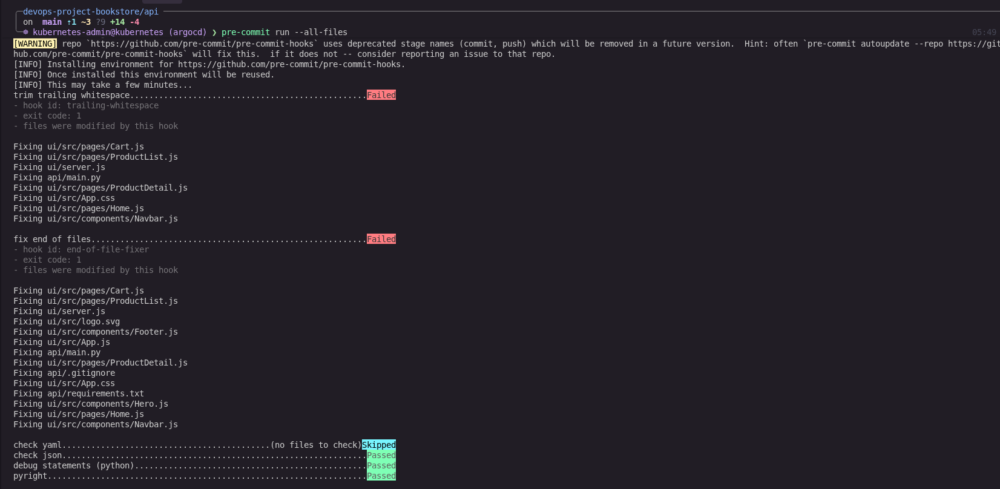
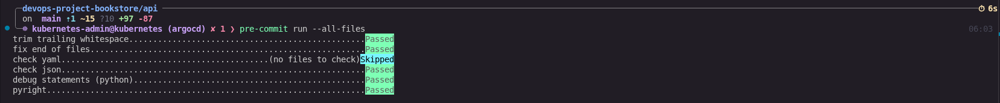

# Bookstore API

Flask REST API serving book categories, products, and cart functionality. Uses mock in-memory data — no database required to run locally.

## Requirements

- Python 3.10+

## Running locally

**1. Create and activate a virtual environment**

```bash
python3 -m venv venv
source venv/bin/activate
```

**2. Install dependencies**

```bash
pip install -r requirements.txt
```

**3. Start the server**

```bash
python main.py
```

The API will be available at `http://127.0.0.1:5000`.

## Pre-commit hooks (shift-left)

Static type checking with [pyright](https://github.com/microsoft/pyright) runs automatically before every commit, catching type errors at the earliest possible point in the dev cycle.

`pre-commit` and `pyright` are included in `requirements.txt` and installed in step 2 above.

**Install the git hook** (one-time, run from the repo root):

```bash
cd ..
pre-commit install
```

**Output:**

```bash
pre-commit installed at .git/hooks/pre-commit
```

From that point on, every `git commit` will run:

| Hook | What it catches |
|------|-----------------|
| `pyright` | Type errors, missing imports, undefined names |
| `trailing-whitespace` | Trailing spaces |
| `end-of-file-fixer` | Missing newline at end of file |
| `check-yaml` / `check-json` | Syntax errors in config files |
| `debug-statements` | Accidental `pdb`/`breakpoint()` left in code |

**Run manually against the api at any time:**

```bash
pyright --project api/pyrightconfig.json api/
```

The pyright configuration lives in [pyrightconfig.json](pyrightconfig.json) (`typeCheckingMode: basic`).

### Bugs 🐛 caught on first run

Running pyright on the initial codebase surfaced 4 type errors across two route handlers, both rooted in the same unsafe pattern.

```bash
/devops-project-bookstore/api/main.py
/devops-project-bookstore/api/main.py:230:23 - error: "get" is not a known attribute of "None" (reportOptionalMemberAccess)
/devops-project-bookstore/api/main.py:231:21 - error: "get" is not a known attribute of "None" (reportOptionalMemberAccess)
/devops-project-bookstore/api/main.py:256:20 - error: "get" is not a known attribute of "None" (reportOptionalMemberAccess)
/devops-project-bookstore/api/main.py:257:21 - error: "get" is not a known attribute of "None" (reportOptionalMemberAccess)
4 errors, 0 warnings, 0 informations

```

---

#### `reportOptionalMemberAccess` — `request.json` may be `None`

**Affected functions:** `add_to_cart` (lines 230–231), `update_cart` (lines 256–257)

**Error output:**

```
main.py:230:23 - error: "get" is not a known attribute of "None" (reportOptionalMemberAccess)
main.py:231:21 - error: "get" is not a known attribute of "None" (reportOptionalMemberAccess)
main.py:256:20 - error: "get" is not a known attribute of "None" (reportOptionalMemberAccess)
main.py:257:21 - error: "get" is not a known attribute of "None" (reportOptionalMemberAccess)
```

**Root cause:**

`Flask.request.json` is typed as `Any | None`. It returns `None` when the request body is absent or the `Content-Type` header is not `application/json`. Calling `.get()` on `None` raises an `AttributeError` at runtime — a crash on any malformed or missing request body.

**Before (unsafe):**

```python
data = request.json          # type: Any | None
product_id = data.get('productId')   # AttributeError if data is None
quantity   = data.get('quantity', 1)
```

**After (safe):**

```python
data = request.get_json(silent=True) or {}
product_id = data.get('productId')
quantity   = data.get('quantity', 1)
```

`get_json(silent=True)` suppresses the 400 exception on bad input and returns `None`; the `or {}` fallback ensures `.get()` always operates on a dict. The result after the fix:

```bash
0 errors, 0 warnings, 0 informations
```


Or run all hooks across the whole repo without committing:

```bash
pre-commit run --all-files
```





## Endpoints

| Method | Endpoint | Description |
|--------|----------|-------------|
| GET | `/api/categories` | List all book categories |
| GET | `/api/categories/:id` | Get a single category |
| GET | `/api/categories/:id/products` | List products in a category |
| GET | `/api/products/featured` | List featured products |
| GET | `/api/products/:id` | Get a single product |
| GET | `/api/cart` | Get cart contents |
| POST | `/api/cart/add` | Add a product to the cart |
| POST | `/api/cart/update` | Update item quantity |
| DELETE | `/api/cart/remove/:id` | Remove an item from the cart |
| POST | `/api/cart/checkout` | Clear the cart |

### Example

```bash
curl http://127.0.0.1:5000/api/categories
```

API response:

```bash
  {
    "description": "Timeless masterpieces from renowned authors.",
    "id": "classics",
    "name": "Classics"
  },
  {
    "description": "Contemporary works from modern authors.",
    "id": "modern",
    "name": "Modern Literature"
  },
```

```bash
curl http://127.0.0.1:5000/api/products/featured
```

Reponse:

```bash
{
    "author": "Leo Tolstoy",
    "category": "Classics",
    "categoryId": "classics",
    "description": "War and Peace is a novel by Leo Tolstoy, published in 1869. It is regarded as one of Tolstoy's finest literary achievements and remains an internationally praised classic of world literature.",
    "id": "1",
    "imageUrl": "/images/books/war-and-peace-leo-tolstoy.jpg",
    "name": "War and Peace",
    "pages": 1225,
    "price": 24.99,
    "published": 1869
  },
  {
    "author": "Fyodor Dostoevsky",
    "category": "Classics",
    "categoryId": "classics",
    "description": "Crime and Punishment focuses on the mental anguish and moral dilemmas of Rodion Raskolnikov, an impoverished ex-student in Saint Petersburg who formulates a plan to kill an unscrupulous pawnbroker for her money.",
    "id": "3",
    "imageUrl": "/images/books/crime-and-punishment-fyodor-dostoevsky.jpg",
    "name": "Crime and Punishment",
    "pages": 671,
    "price": 18.99,
    "published": 1866
  },
```

Get product wwith ID:

```bash
curl http://127.0.0.1:5000/api/products/1
```

Response:

```bash
{
  "author": "Leo Tolstoy",
  "category": "Classics",
  "categoryId": "classics",
  "description": "War and Peace is a novel by Leo Tolstoy, published in 1869. It is regarded as one of Tolstoy's finest literary achievements and remains an internationally praised classic of world literature.",
  "id": "1",
  "imageUrl": "/images/books/war-and-peace-leo-tolstoy.jpg",
  "name": "War and Peace",
  "pages": 1225,
  "price": 24.99,
  "published": 1869
}
```

Frontend now fetches data from the backend making the UI fully functioning.


## Notes

- Cart state is held in memory and resets when the server restarts.
- `psycopg` is listed as a dependency for future database integration but is not used by the current mock data layer.
- The server binds to `0.0.0.0:5000` so it is reachable on your local network as well as `127.0.0.1`.
